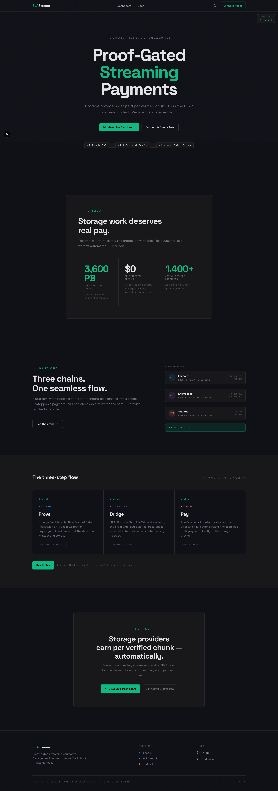
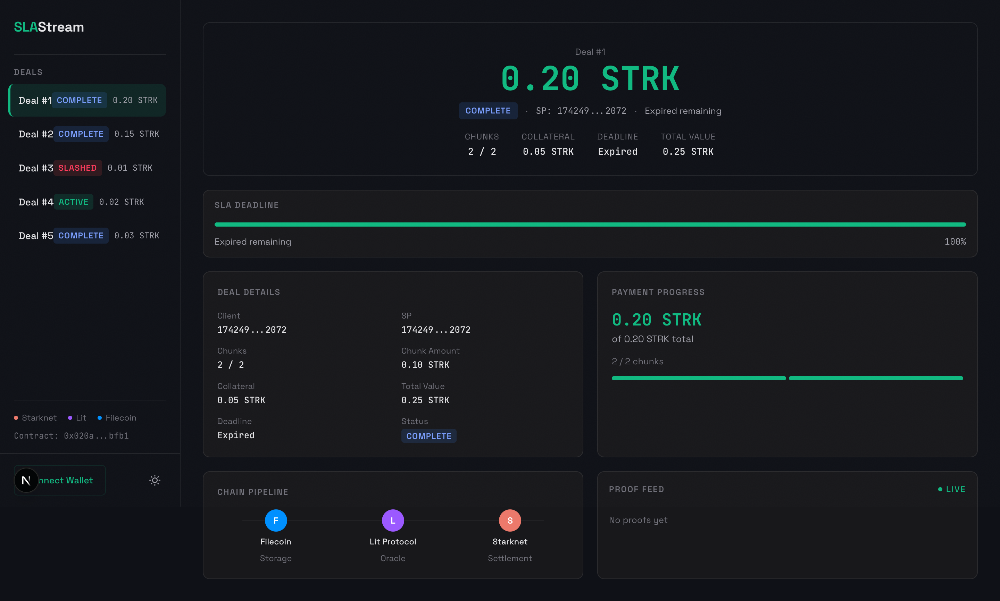

# SLAStream: Cross-Chain Streaming Payments for Filecoin SPs

Proof-gated payment streams that release funds to Storage Providers only when cryptographic proofs confirm data is stored.

[](https://www.cairo-lang.org/)
[](https://www.typescriptlang.org/)
[](https://nextjs.org/)
[](https://starknet.io/)
[]()
[](LICENSE)



## Screenshots

| Landing Page | Dashboard |
|:---:|:---:|
|  |  |

## Live Demo

**Contract:** [SLAEscrow on Starknet Sepolia](https://sepolia.starkscan.co/contract/0x020a11bf272f2af470393707aab6250bbd58c7b6d268df9756846f17ecedbfb1)

Deal #5 settled 3/3 chunks on-chain. Select it in the dashboard to see real transaction hashes linked to Starkscan.

---

## What Is SLAStream?

Filecoin Storage Providers get paid in bulk after long storage periods. This creates cash flow gaps and gives clients no way to enforce SLAs or claw back funds when an SP stops proving data.

SLAStream locks STRK tokens in an on-chain escrow and releases them in chunks, one per verified proof-of-storage event. If proofs stop, anyone can slash the deal and return collateral to the client.

---

## Features

- **Proof-gated payments**: Funds release only when Filecoin PDP proofs are cryptographically verified
- **Cross-chain oracle**: Lit Protocol PKP signs attestations after verifying FEVM proof transactions
- **On-chain sig verification**: Cairo secp256k1 recovery confirms PKP identity before releasing funds
- **Automatic slashing**: Anyone can slash expired deals, returning collateral to the client
- **Real-time proof feed**: Dashboard shows live ChunkReleased events from Starknet with Starkscan links
- **Deal management**: Create deals, browse active deals, monitor payment progress

---

## Tech Stack

| Layer | Technology |
|-------|-----------|
| Smart Contracts | Cairo 2.x, Scarb 2.8, Starknet Foundry |
| Oracle Bridge | Lit Protocol PKP (Chronicle Yellowstone) |
| Relay Service | TypeScript, Bun, ethers.js v5, starknet.js v7 |
| Frontend | Next.js 16, Tailwind CSS, starknet-react |
| Networks | Starknet Sepolia, Filecoin Calibration FEVM |

---

## How It Works

```
Filecoin FEVM              Lit Protocol PKP           Starknet Sepolia
(Calibration)              (Chronicle Yellowstone)    (SLAEscrow)

SP posts PDP proof  -----> Relay detects event -----> release_chunk()
(RootsAdded event)         Lit Action verifies tx     Verifies secp256k1 sig
                           Signs attestation          Releases chunk payment
                                                      to SP

If SLA deadline expires without enough proofs:
Anyone calls slash() ----> Collateral returned to client
```

1. Client creates a deal on Starknet, locking STRK tokens (chunk payments + collateral)
2. Storage Provider stores data, posts PDP proofs to Filecoin Calibration FEVM
3. Relay monitors FEVM for `RootsAdded` events, requests Lit PKP signature
4. Lit Action verifies the proof transaction on FEVM, signs an attestation
5. SLAEscrow verifies the secp256k1 signature and releases the next chunk payment
6. If the deadline passes without enough proofs, anyone can call `slash()`

### Signature Verification

The contract uses Cairo's native secp256k1 support:

1. Relay constructs: `keccak256(abi.encodePacked(dealId, chunkIndex, proofSetId, rootCID, timestamp))`
2. Lit Action verifies the FEVM proof tx, then signs the message with the PKP key
3. Contract recovers the public key and compares against the stored PKP public key
4. Replay protection via per-chunk release flags prevents double-spending

---

## Smart Contracts

| Contract | Network | Description |
|----------|---------|-------------|
| SLAEscrow | Starknet Sepolia | Escrow with secp256k1 sig verification, deal management, slashing |
| MockERC20 | Starknet Sepolia (tests) | Test token for snforge integration tests |

---

## Running Locally

### Frontend

```bash
cd frontend
npm install
cp .env.example .env.local
# Edit .env.local with your contract address and RPC URL
npm run dev
```

### Relay

```bash
cd relay
bun install
cp .env.example .env
# Edit .env with your keys (see .env.example for all required vars)
bun run src/index.ts
```

### Contracts

```bash
cd contracts
scarb build
snforge test   # 5/5 passing
```

---

## Project Structure

```
slastream/
├── contracts/                # Cairo smart contracts
│   └── src/
│       ├── sla_escrow.cairo          # Main escrow: deals, release, slash, sig verify
│       ├── interfaces/               # ISLAEscrow trait definition
│       └── tests/                    # 5 integration tests (snforge)
│           ├── test_sla_escrow.cairo # create_deal, release_chunk, slash, replay
│           └── mock_erc20.cairo      # Test ERC20 token
├── relay/                    # TypeScript relay service
│   ├── src/
│   │   ├── index.ts                  # Entry point: monitor + sign + broadcast loop
│   │   ├── fevm-monitor.ts           # Polls Filecoin FEVM for PDP proof events
│   │   ├── lit-bridge.ts             # Lit Protocol PKP signature requests
│   │   ├── starknet-relay.ts         # Broadcasts release_chunk to Starknet
│   │   └── local-signer.ts           # Local secp256k1 fallback (dev mode)
│   ├── lit-action/
│   │   └── action.js                 # IPFS-hosted Lit Action: verify + sign
│   └── scripts/                      # CLI tools: create-deal, deploy, demo
├── frontend/                 # Next.js dashboard
│   └── src/
│       ├── app/dashboard/            # Deal browser, proof feed, slash UI
│       ├── components/               # DealCard, ProofFeed, CreateDealDrawer, etc.
│       ├── hooks/                    # useDeals, useProofEvents, useTransaction
│       └── lib/                      # Starknet RPC helpers, types, constants
└── docs/                     # Planning docs
```

---

## License

MIT
